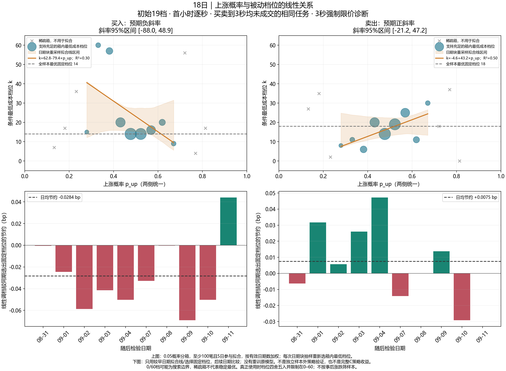
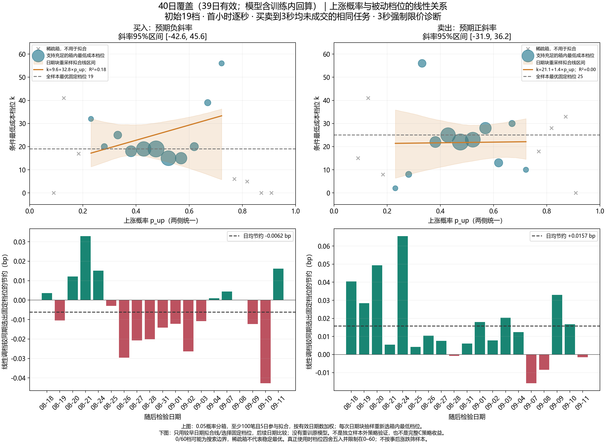
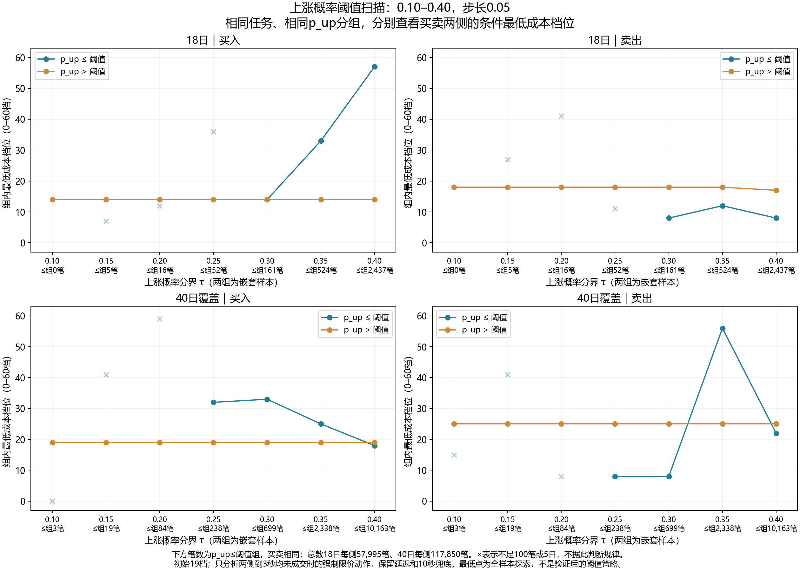

# 短时交易模型：因子、预测与执行研究

利用 IC2609 期货 L1 快照研究短观察窗口中的 LastPrice 涨跌，再检验信号能否改善已有买卖任务的执行成本。研究路径为：59 家族因子与 IC → 三因子及小组合增强 → 两阶段执行 → 固定档位扫描 → 上涨概率与挂档关系。

本仓库为私有研究归档；数据使用已获项目所有者授权。原始数据覆盖 2026-07-20 至 2026-09-11 的 40 个日期，首分钟研究实际使用 38 日；首小时 40 日覆盖版有 39 日有效，且包含训练内回算。所有日期此前已参与探索，结果不代表独立样本外收益。

## 获取代码与完整数据

代码和测试保留完整 Git 历史；大型数据位于本仓库的 [研究快照 Release](https://github.com/031asa/short-horizon-trading-model/releases/tag/research-2026-09-24)。访问代码和附件都需要私有仓库权限。

| 附件 | 内容与还原位置 |
|---|---|
| `research-results.zip` | 各阶段报告、PNG/SVG、汇总、模型参数、逐任务结果及当前原子表；恢复包内相对路径 |
| `20260720_20260911_IC2609.parquet` | 原始 40 日行情 → `新窗口交接_20260921/` |
| `daily_ic.parquet` | 完整逐日 IC → `result/opening_execution/` |
| `release-manifest.json` / `SHA256SUMS.txt` | 源代码版本、附件大小、SHA256、还原路径和排除范围 |
| `research-files.csv` | 结果包内各文件的相对路径、大小和 SHA256 |

在已登录 GitHub CLI 的 Windows PowerShell 中执行：

```powershell
gh repo clone 031asa/short-horizon-trading-model
Set-Location short-horizon-trading-model
gh release download research-2026-09-24 --repo 031asa/short-horizon-trading-model --dir result/github_release/download
python -X utf8 scripts/restore_release_data.py --assets result/github_release/download
```

还原工具只依赖 Python 标准库；先核验全部附件和包内文件，再恢复研究目录。包内根目录的五份源码说明由 Git 提供，不用压缩包覆盖；其余同内容文件跳过，遇到不同内容的同名文件停止，不覆盖已有研究。仅检查可加 `--verify-only`；数据也可从 Release 页面手动下载到同一文件夹。代码更新后请使用 Release 对应版本还原。

运行研究需安装 `environment.yml` 的依赖；本项目使用 Windows 原生环境，无需 WSL。测试入口为 `python -X utf8 scripts/test_opening.py result/local_verification`。接手或查看结果无需重新训练或回测。

## 最近研究：上涨概率能否指导第 3 秒挂档

买卖使用相同任务与相同 `p_up`，仅研究两侧在第 3 秒均未成交的订单；初始挂 19 档，第 3 秒强制限价扫描 0–60 档。图中不是完整 C 策略收益，也不是涨跌预测准确率。

18 日和 40 日覆盖版的线性斜率不稳定，区间均跨零；日期前推比较中，线性调档也没有稳定优于固定 19 档。因此目前没有得到可直接用于执行的稳定线性规则。完整说明与表格下载后位于 `result/opening_execution/opening_ranges/probability_offset_relation/`。







## 接手与历史研究索引

2026-09-28新增：固定五因子、预测观察结束后未来1秒的观察期选择。结果在 `result/opening_prediction/observation_1s/观察期选择报告.md`，独立交付包为 `result/观察期选择_未来1秒.zip`。38日开盘首分钟任务，实际起点统一为整秒后首条快照；18日1035个共同检验任务上，1／2／3／4／5秒准确率为61.34%／62.59%／63.96%／62.58%／62.60%。历史峰值3秒，最近验证按预定规则选择2秒；两快照延迟约1秒，不能把预测表现直接视为执行收益。旧模型/撮合不变，未更新9月24日GitHub数据快照。

随后用户固定观察3秒，完成旧C预测期限比较：初始/后续限价均19档、10秒兜底、18日首小时逐秒62,899共同任务。原旧C成本0.663516bp，五因子1秒候选0.634884bp，同五因子3秒对照0.649513bp，市价0.691966bp。1秒候选相对原旧C节约0.028632bp，95%日期块区间[0.016813,0.043395]，通过切换门槛；开盘首分钟未改善、三组C首分钟均未击败市价。报告在 `result/opening_execution/initial_offset_selection/horizon_comparison/预测期限比较报告.md`，独立包为 `result/旧C预测期限比较_观察3秒.zip`；运行入口为 `python -X utf8 -m scripts.run_horizon_execution` 与 `python -X utf8 -m scripts.deliver_horizon_execution`。原模型、撮合及旧实验保留，尚未更新GitHub快照。

最新完成初始档位两种选法对照：观察3秒、预测1秒、后续19档不变，扫描初始0–60整数档。18日首小时62,899共同任务、首分钟1,080共同任务，新增排除0。提前贡献=3秒内成交率×这些成交相对立即市价的平均节约；首小时最大在6档，但完整成本0.732913bp，比市价贵0.040947bp。按完整成本选仍为19档，成本0.634884bp、省市价0.057082bp；邻近档位差异区间多跨0。首分钟两种方法选13/49档，完整成本1.277718/1.095872bp，均未击败市价0.939636bp。前8/13日选档、后5/5日检查，首小时完整成本选20/19档，未优于一直固定19档；此前预测期限已用全部18日选择，因此仅为探索性前推。报告、4张PNG/SVG、完整CSV及7,673,678条逐任务结果在 `result/opening_execution/initial_offset_selection/initial_offset_sweep/`，独立包为 `result/初始档位两种选法_观察3秒预测1秒.zip`。运行 `python -X utf8 -m scripts.run_initial_offset_selection` 与 `python -X utf8 -m scripts.deliver_initial_offset_selection`；145项测试、全部成交成本独立复算、旧模型/结果及公共撮合指纹保护通过。没有自动部署所选档位，未上传远端。

**新窗口先读 [AGENTS.md](AGENTS.md) 和 [项目交接.md](项目交接.md)，无需通读本README或整个文件夹。** 最新实验为固定观察3秒、预测1秒的初始档位扫描，结果目录如上。本README其余内容保留各阶段技术演进，旧“当前”描述需结合所属阶段理解。

运行 `python -X utf8 scripts/package_research_results.py` 将报告、图片、表格、模型参数和主要逐任务数据汇总为 `result/研究结果汇总.zip`，附阅读指南、文件清单与SHA256核验。压缩包不包含原始行情、暂存缓存、已取消的日期验证，以及约1GB的完整逐日IC；保留完整IC汇总Parquet及短窗口逐日IC。代码通过Git单独管理，结果文件仍按原目录保存。

## 原单因子 IC 实验参数

| 参数 | 默认值 | 含义 |
|---|---|---|
| 开盘 | AM 09:30，Asia/Shanghai | 本轮只分析上午 |
| cold_start_seconds | 10，可调 | 开盘起积累历史，此前不产生任务 |
| task_step_seconds | 1 | 每天第 10–59 秒各产生一次任务 |
| observation_seconds | 1、2、3、4、5 | 任务产生后再观察多久，然后计算信号 |
| history_seconds | 5、10 | 窗口型因子回看长度，可含任务前已积累的历史 |
| horizons_seconds | 1–30，逐秒 | 信号形成后，分别检验的未来期限 |
| execution_delay_snapshots | 2 | 延迟对照从观察结束后第二张快照开始；主 IC 从观察结束开始 |
| tick_size | 0.2 | 标签以 LastPrice 的 tick 变化计 |

观察期与因子历史窗口分开；延长观察期改变信号时刻，不自动增加因子列数。本轮完整实现 PDF 的 59 个家族，计算输出、别名与质量字段分别登记。不同任务若在同一时刻结束观察，应得到完全相同的因子。第一分钟限制任务产生；最后任务可以在第 64 秒完成观察，之后继续取得标签。

数据缺口超过 1 秒则断开对应历史片段；历史覆盖要求 80%，当前快照陈旧及未来对齐误差各不超过 0.5 秒。缺失、常数列和有效零值分开。逐日 Pearson IC 与 Spearman Rank IC 至少要求 20 对；逐日算完后对有效日期等权平均。此门槛不是显著性保证。

## 运行与环境

用户已明确本项目无需 WSL，本次实际使用 **Windows 原生 Python 3.12**。`environment.yml` 记录直接依赖，可用于创建等价 Conda 环境；本次没有运行 WSL 或创建 Conda 环境。

当前机器使用 Codex 附带 Python，额外的 PyArrow 和绘图依赖位于项目 `.cache/python-packages`，入口脚本会自动加载。命令在项目根目录执行：

```powershell
$projectPython = 'C:/Users/Hello/.cache/codex-runtimes/codex-primary-runtime/dependencies/python/python.exe'
& $projectPython -X utf8 scripts/test_opening.py result/opening_execution/.review_pending
& $projectPython -X utf8 scripts/run_opening_ic.py --cold-start 10 --observations 1 2 3 4 5 --publish
```

其他机器在安装 `environment.yml` 中的依赖后，可用对应 Python 运行相同入口。移除 `--publish` 可生成候选表和结果而不替换当前原子表。参数来源写入 `experiment_manifest.json`，不要混合不同次运行的文件。

Notebook 入口为 `行情转原子执行表.ipynb`，调用同一套基础实验代码，不再维护独立的旧撮合函数。上面的研究运行入口重建 PDF 基础实验；最新的方向机制审阅还需执行下述审阅步骤。

## 输入、输出与历史边界

- 原始行情：`新窗口交接_20260921/20260720_20260911_IC2609.parquet`，保持原样。SHA256 校验写入代码和结果清单。源文件按交接路径保留，没有另复制到 data。
- 当前原子表：`sample_snapshot_原子执行总表.parquet`。按用户要求复用此文件名，**新表结构为任务＋因子＋未来标签**，不再包含旧 k/H 执行收益。元数据键为 `atomic_ic`，规则为 `opening-task-observation-ic-full-v2`。历史脚本不可直接按旧表结构读取它。
- 结果目录：`result/opening_execution/`。含 `全部因子IC与衰减.html`、`IC研究结果.md`、`feature_registry.csv`、`factor_hypotheses.csv`、`factor_coverage.csv`、`family_coverage.csv`、`daily_ic.parquet`、`summary_ic.csv`、`summary_ic.parquet`、`experiment_manifest.json` 和原始数据审计文件。是否已经替换当前表，以清单的 `published` 为准。
- 当前源码：`utils/opening_schedule.py`、`utils/opening_ic.py`、`utils/opening_features.py`、`utils/factor_catalog.py`、`utils/ic_statistics.py`、`scripts/run_opening_ic.py`、`scripts/render_opening_ic.py`。
- 当前测试：`tests/test_opening*.py`。全目录还有旧研究测试，它们依赖交接包内模块，不属于本轮测试入口；直接发现全部旧测试会因缺少 `rebuild_delay3_bp` 导入而失败。
- 旧研究资料、交接包和原始行情未改写；`新窗口交接_20260921/复现参考/` 留存旧执行逻辑，不能与本轮 IC 混用。

当前取消开发／验证划分，38 个有效上午开盘全部进入研究，汇总统一 `phase=all_sample`。当前原子表为 38 × 50 × 5 = 9,500 行。全部日期已在旧项目探索过，不能称为未见测试集。

IC 不是预测正确率或交易收益。重叠标签、同一时刻的重复观察方案不能当独立试验累加。负 IC 保留原符号；幅度/状态因子同时评价绝对价变。暂不根据本轮排行榜选择模型、执行策略或事后最佳期限。

整段无行情日期单列在 `result/opening_execution/excluded_openings.csv`；部分缺口及处理记录在 `数据异常说明.md`。2026-07-21 首分钟存在 10.5 秒相邻行情间隔，保留该日但按连续性规则使受影响数据缺失。后续发现影响口径或结果的异常，应向用户说明日期、影响和处理，不静默改数或删日。

## 全量 IC 与衰减网页

直接用新版 Edge / Chrome 打开 `result/opening_execution/全部因子IC与衰减.html`，无需部署或网络。默认按家族显示全部输出，支持历史窗口、观察期、时间基准、评价目标、样本口径、累计／新增响应与 Pearson／Spearman 切换。点击因子查看逐日分布摘要、覆盖与缺失原因。网页只包含汇总；完整逐日明细使用 Parquet。

共同样本对每个因子独立要求跨全部 5 个观察期及 30 个未来期限有效。累计与新增响应分别求共同样本，原始负 IC 不翻转。逻辑预期先登记，属于已查看部分期货结果之后的研究假设；本轮不按 IC 调参数、不拟合固定半衰期、不进行显著性或收益判断。全部参数与覆盖原因见结果报告。

`--features-only` 可单独重建并验证候选原子表；`--reuse-features` 会校验原始行情、配置、特征源码与候选表指纹后复用，避免重复计算。未加 `--publish` 的产物统一留在结果目录的 `.pending` 中，当前发布结果保持原样。

验收记录：本轮 40 项单元测试通过；另完成真实数据的前缀截断、独立标签选点、原有 30 列与旧 IC 兼容比较、累计／增量恒等式、R06 窗口恒等式及新增因子的独立逐日 IC 抽查。完整计数见结果清单。浏览器使用离线的本地 file 页面验收，未发起外部请求。

可用 `scripts/verify_opening_artifacts.py result/opening_execution` 复核发布数据；`tests/opening_dashboard.cjs result/opening_execution` 是额外的网页验收入口，需要本机 Edge 与 Playwright。默认研究运行不依赖浏览器。`--reuse-evaluation` 仅在候选目录仍保留完整 IC 时使用，须逐项匹配计算输入、统计方法和结果指纹。

网页“预期与 IC”可筛选逻辑正向且原始平均日 IC > 0，期限可选择任一期、全部 30 期或指定秒数。`全部因子IC与衰减.html#positive` 直接进入计算因子的正向绿色筛选；默认研究口径下为 31 个至少一期为正、4 个全部期限为正。筛选随当前观察期、目标、样本、时间基准、响应及相关系数同步变化；完整曲线保留原符号。`逻辑正向且绿色IC_筛选清单.csv` 为默认口径导出。

看板排列更新：按当前评价目标的逻辑预期“正向 → 负向 → 不确定 → 不适用”分组，组内保持 F／A／B／C／D／M／R 家族编号顺序。筛选区下方显示随选项变化的 IC 公式，包含观察时点、累计／新增与有方向／绝对标签、配对或共同样本、Pearson／Spearman 及日期等权汇总；质量视图说明不计算 IC。

## 2026-09-22 方向机制审阅（当前展示版本）

用户授权更激进地明确方向假设，并在需要时修改表达后重测。原有 275 个计算输出中，96 个“不确定”升级为明确研究假设：正向 104、负向 46、不确定 125；另新增 28 个方向交互（正向 26、负向 2）。当前合计 303 个计算输出、6 个别名、284 个质量字段，仍为 59 家族、38 日、9,500 行。原角色与原表达不变，单侧幅度输出的方向假设附带条件。

看板默认“激进研究假设”，支持切回“原始登记”及筛选“原有表达／新增方向表达”。原始视图隐藏新增表达；新旧预期均可追溯，IC 不随预期切换改变。逐项理由、条件、竞争机制见 `有方向逻辑预期审阅.md` 与 `逻辑预期逐项审阅.csv`。最初 `factor_hypotheses.csv` 保留原样，新审阅在 `directional_hypotheses.csv` 单独冻结。此批数据已经看过，不标为期货事前检验。

新增表达只在当前原子行组合已知父因子。父因子缺失仍为缺失，精确年龄门槛不放宽；门控未激活且所有父因子有效时记零。新增 IC 完整覆盖原有全部评价组合；不根据结果反改假设。默认口径下有 16 个预期正向新增表达在 30 期均为负 IC，两个预期负向表达在多数期限为正 IC，因此不能宣称方向化已经改善预测。

可复现流程如下。初次运行会把原 275 因子实验保存到 `.cache/directional_review_base` 并校验指纹；再次运行复用该不可改写基准。`build` 写入 `.review_pending`，只重算新增表达并逐值核对原表和原 IC，验收后才发布。此脚本是基础实验之后的审阅步骤，不另建一套行情或 IC 口径。

```powershell
& $projectPython -X utf8 scripts/review_directional_ic.py build
& $projectPython -X utf8 scripts/test_opening.py result/opening_execution/.review_pending
& $projectPython -X utf8 scripts/verify_opening_artifacts.py result/opening_execution/.review_pending
& $projectPython -X utf8 scripts/verify_directional_review.py result/opening_execution/.review_pending
& 'C:/Users/Hello/.cache/codex-runtimes/codex-primary-runtime/dependencies/node/bin/node.exe' tests/opening_dashboard.cjs result/opening_execution/.review_pending
& $projectPython -X utf8 scripts/review_directional_ic.py publish
```

单元测试入口先加载项目 PyArrow，再加载 pandas，避免混用系统和项目 Arrow 版本造成扩展类型注册冲突。当前 49 项测试；真实数据另核对新因子的父输入有效性交集、跨缺口／未来扰动、所有新增因子的独立逐日相关与汇总，网页校验原／新假设、来源筛选和原始 IC 不变。完整证据保存在结果目录。

原版绿色筛选的 31／4 是“原始登记”口径；本次默认“激进研究假设”下为 64 个至少一期为正、5 个全部 30 期为正。这只是展示条件，不能将数量增加解释为预测能力改善。完整 IC 始终保留红色和缺失期限。

## 可输入的回看窗口（最新展示）

普通回看扩展为 **1–10 秒整数**。默认按表达合并，不再为同一表达的每个窗口重复列一行；上方输入全局默认值，或在行内输入单独的回看秒数，按 Enter／失焦后应用。当前为 **175 种计算表达、1,271 个计算版本**，加上 6 个别名和 1,100 个质量版本。38 日、9,500 个任务行、全部 LastPrice 标签与 IC 统计方法不变。

输入只切换已经真实计算的参数版本，不插值或在线拟合 IC。当前不接受小数、0、负值或超过 10 秒的输入。别名、固定事件参数、短长均线及外层统计分别标注：前后两段仍各 2／5 秒，M04/M05 滞后 2 秒，M06 为 5／10 秒，M07–M09 外层 5 秒，B09 为历史 10 秒／事件 2 秒，D09 滞后版为历史 10 秒／滞后 2 秒。快照／累计表达没有可随意替换的普通回看参数。

原始登记视图只展示之前的 5／10 秒原始表达；新增回看参数记录于 `window_hypotheses.csv`，在计算前冻结并沿用相同表达的机制假设。共同样本仍针对单一回看版本，跨观察期及未来期限求交集；不跨回看窗口。不能把窗口版本数量当成独立因子数量，也没有自动选优窗口。

`scripts/extend_history_windows.py` 接在已完成的方向审阅之后运行。先将当前审阅实验保存到 `.cache/history_window_base`，逐日计算新增窗口，再按家族并行计算新增 IC；原有值、状态、标签和全部 IC 对照保持一致。候选目录为 `.window_pending`，可恢复已完成的日期和家族计算。

```powershell
& $projectPython -X utf8 scripts/extend_history_windows.py features
& $projectPython -X utf8 scripts/extend_history_windows.py evaluate
& $projectPython -X utf8 scripts/extend_history_windows.py render
& $projectPython -X utf8 scripts/test_opening.py result/opening_execution/.window_pending
& $projectPython -X utf8 scripts/verify_opening_artifacts.py result/opening_execution/.window_pending
& $projectPython -X utf8 scripts/verify_history_windows.py result/opening_execution/.window_pending
& 'C:/Users/Hello/.cache/codex-runtimes/codex-primary-runtime/dependencies/node/bin/node.exe' tests/opening_dashboard.cjs result/opening_execution/.window_pending
& $projectPython -X utf8 scripts/extend_history_windows.py publish
```

本轮新增 4 项历史窗口测试，合计 53 项。包括真实回看起点、短窗支持门槛、旧窗不变与历史派生因果性。完整数据核查与输入框测试另存结果目录。绿色筛选 CSV 展开全部窗口版本，网页默认合并窗口；需选择“展开全部窗口版本”才能直接对照 CSV 数量。详细说明见 `result/opening_execution/可输入回看窗口说明.md`。

分段比较表达也合并为单行：每段长度可输入已计算的 2／5 秒，分别比较相邻两段共 4／10 秒。包括 A08、C08、D03、R05 的分段变化及对应别名。普通回看输入独立于每段长度，固定差分滞后不归入此控件；完整展开仍保留全部原始版本。

当前逻辑预期已恢复保守口径：额外主假设与新增交互方向暂归不确定。175 种表达为正向 28、负向 4、不确定 143；所有 IC 原值保留。当前登记以 feature_registry.csv 为准；计算前冻结文件仅记录当时假设。可用 scripts/restore_conservative_priors.py 同步登记、看板与正向筛选导出。

短观察期逐期限比较：result/opening_execution/短观察期因子初筛.html 主实验采用观察＝回看 1–5 秒，未来 1–30 秒分别从各组观察结束起算。附加同一结束时点的历史量诊断；28 种明确预期表达完整展示，4 种特殊参数另列。取消跨期限平均分与延迟筛选门槛；11 种早段／首秒候选，但目前没有通过“短窗接近有效长窗”的研究性区间规则。页面显示实际快照数量、完整曲线及逐期限配对差异；33,600 个原口径汇总已复核。运行 scripts/screen_short_windows.py 计算，再运行 scripts/render_short_windows.py 出报告与网页；原数据不改写。测试共 60 项，结果不代表统计显著或交易收益。

## 短窗口涨跌预测试验

新试验在 `result/opening_prediction/短窗口涨跌预测检验.html`，不修改原有 IC 页面和原子表。六个单因子、最新快照三因子组合、观察＝回看 1–5 秒的六因子组合，分别预测观察结束后 1／2／3 秒的 LastPrice 涨／平／跌。采用 L2 softmax 逻辑回归，前 20 日训练后逐段向前检验，共 18 个检验日；参数及最佳单因子只在每折训练期内部选择。原始 38 日已用于筛选因子，因此这里只是内部诊断。

本机应用控制阻止新 scikit-learn 二进制加载，实际执行使用已有 NumPy 的 Newton 求解器，无新增运行依赖。对称 L2 惩罚所有类别的斜率，不惩罚截距；目标为日期等权平均交叉熵加 `||coef||² / (2*C*n_train)`。有限差分验证梯度与 Hessian，保存每折标准化和系数，可独立复算全部预测。继续使用用户指定的 Windows 本机运行方式。

依次运行 `scripts/run_opening_prediction.py`、`scripts/render_opening_prediction.py`、`scripts/verify_opening_prediction.py`。`scripts/test_opening.py result/opening_prediction` 运行 68 项测试；`tests/opening_prediction_dashboard.cjs` 检验离线网页。实验配置在首次拟合前冻结，复跑需同一输入和参数。网页提供共同任务／各窗有效任务、分类混淆、高概率信号覆盖与逐日期配对差异。原子表校验指纹不变；新试验不引入撮合、盈亏或下单策略。

六因子共线性诊断运行 `scripts/check_factor_collinearity.py`，结果位于 `result/opening_prediction/collinearity/六因子共线性报告.md`。只检查输入矩阵，不重训模型：日期等权／等行权、去除日均值、逐日及原训练段的 Pearson、Spearman、未正则化 VIF、标准化条件数与矩阵秩。主口径观察＝回看 1 秒，1–5 秒作为补充；逐因子辅助回归 VIF 与逆相关矩阵对角线交叉复核。额外三项测试覆盖正交、精确共线、常数列与量纲不变性。

三因子显著性探索运行 `scripts/check_three_significance.py`，输出到 `result/opening_prediction/significance/`。第一折训练20日、固定当时C的1000次整日重采样用于系数方向稳定性；组合预测使用18日配对差的精确双侧符号翻转、六项Holm校正及四检验段整块翻转敏感性。条件系数区间不是普通回归p值；结果不校正此前的因子／期限筛选，不代表独立验证显著性。

## 无冷启动的3秒小组合实验（当前实验口径）

用户取消10秒冷启动：每次任务只使用自身 `[T,T+W]` 观察区间内的信息，观察＝回看，连OFI／成交差分的前一快照也不得越过T。任务从开盘第0–59秒每秒生成；W取1／2／3／4／5／8／10秒，未来3秒从各自观察结束起算。38日共15,960行，原9,500行实验和旧看板不改写。源行情缺口和80%实际历史跨度规则保留，不因窗口短而借用历史。

运行 `scripts/run_no_cold_combinations.py` 生成原子表并进行训练日期内部的小组合搜索，再运行 `scripts/render_no_cold_combinations.py`、`scripts/verify_no_cold_combinations.py`。结果为 `result/opening_prediction/no_cold_start/无冷启动_3秒小组合.html`。25个主效应和6个固定交互，最多5列，VIF≤5且两两相关绝对值<0.9；参数、成员和窗口仅通过内部验证选择，窗口比较使用共同验证任务。每折结果可断点复用，输入和特征源码有指纹校验。采用已有NumPy逻辑回归，不增加运行依赖。

看板显示全部窗口、开盘0–9秒与10–59秒任务、各折实际成员、相同覆盖率诊断以及训练期冻结阈值的命中率。原子表边界、475项公式对照、19个独立任务切片、原9,500个标签一致性、56个模型的15,120条预测和共线性限制均复核；测试合计79项，离线网页966个数据单元格对照通过。新小组合未在整分钟稳定超越三因子，不能据首10秒的局部改善宣称已实现可靠高胜率。

完整期限扩展：运行 `scripts/extend_no_cold_horizons.py` 后重新运行 `scripts/render_no_cold_combinations.py`，同一看板新增观察结束后未来1–30秒准确率、样本详情与曲线。冻结已有3秒模型、组合、窗口选择和训练期阈值，只扩展累计／逐秒新增LastPrice标签，不代表每个期限分别重训。可选逐期限有效样本或七窗口、两类模型、全部30期限的共同任务；真实不变保留，准确率逐日等权。原3秒全量及冻结阈值结果逐项核对，输入文件指纹不变。完整CSV、逐日明细和标签保存在同一结果目录；`tests/no_cold_horizons.cjs` 检查全部23,040个期限单元格、明细与曲线。

## 固定三因子增强与窗口选择

独立实验固定保留最新OFI、报价位移、末价盘口位置，观察＝回看1–10秒，零冷启动，38日共22,800行。枚举原三因子、加1／2个主特征以及6个预定义复合表达与必要主效应；不按单因子IC提前删选。内部训练确定候选覆盖并检查共线性，完整训练重拟合设计再次复核；最大VIF≤5、两两相关绝对值<0.9，所有系数共同重拟合。与三因子同样本比较，统一按未来3秒训练，同一信号评价1–10秒累计和新增价变。

依次运行 `scripts/run_anchored_three.py --workers 2`、`scripts/report_anchored_three.py`、`scripts/verify_anchored_three.py`。复用既有Windows本机NumPy运行时，无新增依赖。输出位于 `result/opening_prediction/three_factor_enhancement/`，仅生成报告、表格与完整数据，不新建看板。原子表、逐任务预测、全部候选与参数、共线性及被三因子解释的R²、模型系数、折间选择和全历史拟合配置均可审阅。旧实验所有文件指纹保持不变。

训练期先按3秒日等权准确率筛选；0.5个百分点容忍范围内再比较5–10秒平均准确率，然后依次偏好短窗口、少列、低3秒Log loss、强正则。每窗口先选结构赢家，再选增强方案，最后跨窗口比较，包含退回原三因子的选项。四折前推检验18日，全部10窗口共同任务1080条。训练选窗口依次8／3／7／3秒，其3秒准确率53.06%，同窗口三因子52.41%；成员和窗口变化较大，尚未找到稳定更优窗口。全历史最终8秒配置只供下一批新数据检验，不把历史流程胜率归到该固定配置上。

验收87项测试通过；684个真实任务切片复算、456,000个标签值对照、200个模型与54,000条检验预测重放、250次结构选择和5次窗口选择复核、1,040条共同样本期限曲线复算。完整训练设计复核后的已选模型最大VIF为3.866；5个候选配置在该复核阶段超标拒绝，所有拟合均收敛。运行 `scripts/test_opening.py result/opening_prediction/three_factor_enhancement` 可保存单元测试凭证。

运行 `scripts/plot_opening_accuracy_time.py` 查看模型准确率随09:30–09:31信号时刻的变化，输出在本实验的 `time_of_minute/`。主图固定观察3秒、预测未来3秒，使用18个检验日的冻结预测；最近10秒滚动准确率配合逐秒原值、分段样本数及配对差值的日期块逐点区间，另附全部1–10秒观察窗口图。不把不同折选择的窗口混进主图，不按时段重新训练。信号必须在首分钟内，未来标签可越界；主图1,026任务，不含09:31后才形成的信号。20项分段聚合对照和原数据指纹检验随结果保存。

## 两阶段执行消融（T～T+3，T+3～T+10）

运行 `scripts/run_two_stage_execution.py`，再运行 `scripts/plot_two_stage_execution.py`。结果在 `result/opening_execution/two_stage_ablation/`，保存表格、报告、静态图片、完整成交路径及冻结模型信号，不新建看板。保留全部原预测实验。只用四折冻结的3秒增强模型，不重训、不按执行收益选参数。

A基准在T按LastPrice挂0档限价；B先观察3秒再下单；C在T先挂0档限价，第3秒仍未成交才按与B相同的信号规则处理。买入遇预测上涨、卖出遇预测下跌则转市价，否则按第3秒LastPrice挂／改限价；不变信号走限价。第6／9秒不再更新，全部策略统一T+10提交市价兜底。下单及原子撤换各延迟决策后第2条快照，原单撤换在途仍可成交；同快照原单成交优先，限价相同不重复下单。市场单按生效快照对手价、限价单按既定对手价触发或正成交量LastPrice严格穿价规则，在限价结算。单位订单，无排队、冲击、手续费或部分成交，属于L1撮合代理。

18个检验日共有1,080个名义任务。每天第0秒尚无开盘报价，不能借未来报价定初始限价，统一排除18个；三策略、买卖双向共有1,062个共同任务、6,372条有效执行路径。按同一起点LastPrice衡量有符号成本，逐日等权、买卖各半。A/B/C成本分别1.771／1.431／1.853bp；B较A节约0.340bp，C较A为−0.082bp。C比B多花0.422bp，未发现本轮先挂单带来成本改善；C平均更快完成，成本与完成速度分别评估。区间用5日日期块重采样，仍为已有日期上的探索结果。

1,080条冻结概率重放、54组观察边界截断／扰动、324条路径未来扰动、6,372笔独立最早成交扫描及原输入指纹验证通过。运行 `scripts/test_opening.py result/opening_execution/two_stage_ablation` 保存113项测试凭证，包含成交触发、严格穿价、延迟、同快照优先级、在途旧单成交、共同截止时刻及异常数据处理。主结果、分方向、四折、逐日、时段与消融贡献都保存在独立实验目录。

只看每天第一笔发单，运行 `scripts/report_first_order_execution.py`，输出到 `result/opening_execution/first_order_ablation/`。09:30:00整缺少报价，改用首条实际开盘快照作为可发单起点T（09:30:00.1～00.5），观察结束和兜底分别是T+3、T+10；不能把该口径误写成09:30:00整。原四折W=3增强模型不重训，在新时点重算观察区间特征。18天买卖各一笔，相对A基准，B严格胜率18/36=50.0%、平均节约1.557bp；C为3/36=8.3%、平均节约−1.055bp，26/36持平。小样本的日期块节约区间均包含零，暂不能确认稳定改善。18组特征截断及108条最早成交独立重放通过，方向预测准确率另表保存。

每分钟扩展运行 `scripts/run_minute_execution.py`，输出在 `result/opening_execution/every_minute/`。上午09:30–11:29、下午13:00–14:59，每分钟整点后首条快照发起任务（偏移≤0.5秒），各自观察3秒、10秒兜底。冻结原开盘模型检验向全天迁移，不重训或选阈值。18日4,320个名义任务中，共同有效4,196个；51个无及时快照、73个路径或信号无效，具体分钟及原因单列。全天B较A节约0.0108bp，95%日期块区间含零；C为−0.0677bp。09:30–09:59的B平均节约0.3075bp，但属于本轮时段探索，不能直接认定为稳定可用时段。保存完整240个分钟点、半小时、上午／下午、分买卖及逐任务明细；25,456笔有效路径独立最早成交复算、179组区间截断、09:30首笔108条对照均通过。曲线用最近10个分钟点平滑，午休两侧分别处理。

立即市价对照运行 `scripts/compare_minute_market.py`，结果在上述目录的 `market_comparison/`。新增M在任务开始即提交市价，仍延迟两条严格未来快照，按到达对手一价成交；不是按LastPrice或零延迟成交。原4,196任务全部保留，无额外排除，8,392笔双向市价均通过路径、价格和队列量检查；买卖平均成本与半价差恒等式逐任务通过。全天M成本0.6316bp，A/B/C分别比M多花0.2364／0.2256／0.3041bp。原来09:30–09:59的B虽优于A，相对M仍多花0.3871bp。市价对照与原A对照分别保留，不把基准变化混入原表。

开盘前1／19／30／60分钟比较运行 `scripts/compare_opening_ranges.py`，输出在 `result/opening_execution/opening_ranges/`。主表统一每分钟一笔、上午从09:30起算；前19分钟严格截止09:49之前。有效任务依次18／342／539／1066个。B较A节约依次1.5566／0.5100／0.3075／0.1047bp，均仍比相同延迟的立即市价更贵。截图中的首分钟逐秒1,062任务独立补表，复现B较A节约0.340221bp；该原任务组立即市价成本0.8992bp，B为1.4307bp，比市价多花0.5315bp。两个采样频率分别展示，不能混用；保存分方向、胜率、日期块区间和逐日结果。

四个时间段均新增每秒任务，运行 `scripts/run_second_ranges.py`，更新同目录为“4个时间段×分钟／秒”8行对照。计划逐秒任务分别18×60、18×1140、18×1800、18×3600，缺失后有效数量单列。为了与分钟行公平比较，所有任务均取对应整秒后的首条快照（偏移≤0.5秒）为实际T，而非把该快照倒填到整秒；整分钟任务必须与原分钟实验逐笔完全一致。冻结模型及执行规则不变，逐笔独立复核最早成交、保留无效任务和特征边界检查。原截图的1062整秒任务另存历史表，不与新增起点口径混合。已有逐秒数据时 `scripts/compare_opening_ranges.py` 自动重汇总8行表，不退回旧口径。

C限价被动偏移实验运行 `python -m scripts.run_c_passive_offset`，结果在 `result/opening_execution/opening_ranges/c_passive_offset/`。只对C的初始及第3秒限价设置1 tick偏移（买低0.2、卖高0.2），保持市价分支和10秒期限。冻结信号并复现原C零偏移结果；前1／19／30／60分钟逐秒相对原C分别节约0.0554／0.0437／0.0445／0.0483bp，但仍比B和立即市价贵。因等待更久遇到路径缺口额外共同剔除5个任务，首小时有效63,283个；记录明细、日期块区间及成交方式比例。116项测试通过。

C多档对照运行 `python -m scripts.run_c_passive_offset --sweep`，在上述目录的 `multi_offset/` 比较0–5 tick，全部档位及买卖方向统一共同任务。原单档实验保留。前1／19／30／60分钟逐秒任务分别1080／20484／32190／63176；较原首小时共同剔除112个任务。首小时C成本由0档0.990降至5档0.787bp，B为0.887、市价0.692bp；5档限价成交60.30%、10秒市价兜底11.42%、平均耗时4.21秒。档位为已有数据探索，不声称样本内最低值是实盘最优。保存逐档逐任务、逐日、缺口明细和日期块区间，2–5档逐笔复核最早成交。

C档位拐点搜索：依次运行 `python -m scripts.run_c_passive_offset --sweep --max-offset 20`、`python -m scripts.run_c_passive_offset --sweep --coarse-tail`、`python -m scripts.refine_c_early_offsets`、`python -m scripts.analyze_c_offset_search`。结果保存在 `c_passive_offset/offset_search/`。主扫描0–20逐档，另查24/28/32/40/60/100档；首分钟补齐0–100全部整数档，前19分钟补齐0–28档。所有档位按时段取共同任务，冻结信号和撮合规则；保留早期0–5档实验。每秒任务历史最低档：首分钟59、前19分钟23、前30/60分钟19；首小时19档成本0.663587bp，14档0.663780bp，但平均耗时6.33秒对6.91秒，兜底30.20%对38.11%，因此14档可作为较少等待的候选。14–19档成本差缺乏清晰统计区分；最低点是历史探索而非独立验证的最优。四日期块首小时最低档20/14/14/16；首分钟59/41/48/66，开盘首分钟更不稳定。最终首分钟/19/30/60分钟逐秒共同任务1080/20477/32171/62982。保存日期敏感性、未作选择校正的配对区间、逐任务结果和成本曲线；29项撮合测试通过，参数测试覆盖至40档。

四策略完整静态对比运行 `python -m scripts.deliver_four_strategy_comparison`，输出至 `result/opening_execution/opening_ranges/four_strategy_c19/`。固定M立即市价、A初始LastPrice限价、B先观察3秒、C初始与3秒限价被动19档；不展示或重新选择各时段最低点。沿用8组共同样本，前1/19/30/60分钟的分钟任务18/342/539/1060，秒级任务1080/20477/32171/62982。125,964笔立即市价逐任务核对到达价格和时间，并检验买卖平均市价成本与半价差恒等式。交付4张PNG及SVG、8组总表、96行分方向汇总、逐日结果、503856行四策略配对数据和验收说明；成交构成与胜平负合计100%，成本与原C19结果精确复核一致。

40日覆盖的四策略同版式图运行 `python -m scripts.run_four_strategy_all_dates`，输出至 `result/opening_execution/opening_ranges/four_strategy_c19_all40/`，独立压缩包为 `result/四策略完整对比_C19_40日覆盖.zip`。按用户确认统一用最新保存W3第四折模型重新跑所有日期（训练截至2026-09-08），C固定19档，含训练内回算，仅作探索。原18日结果文件保持不变；最后3日82,888笔四策略执行与旧版逐值完全一致。07-20前一小时无行情、07-27从09:43:16.5开始、07-28首条09:30:01，实际有效日期37–39日，图中与覆盖表明确标记。首1/19/30/60分钟的分钟任务37/720/1146/2279，秒级任务2258/43233/68473/135318。全部1,082,544笔配对执行保留，1,086,984笔策略成交独立复核，1152次特征边界检查与454组充分条件全档位抽查通过；另有360个模拟场景及缺口/零队列拒绝验证。输出四张PNG/SVG、汇总表、逐日和逐任务结果、逐日模型关系与排除明细。首小时逐秒C19成本0.757898bp，对应市价0.781538bp，节约0.023640bp。

第3秒三动作阈值实验依次运行 `python -m scripts.run_three_action_threshold`、`python -m scripts.verify_three_action_threshold`、`python -m scripts.deliver_three_action_threshold`。结果在 `result/opening_execution/opening_ranges/three_action_threshold/`，独立包为 `result/三动作阈值实验_40日覆盖.zip`；原实验和模型保持不变。初始19档，T+3仅对未成交订单选择市价、当时LastPrice、被动19档，T+10兜底。模型概率差只作方向强度，不等同跌幅；预登记0/.025/.05/.075/.10/.15/.20/.30，统一按首小时逐秒日期等权成本选一个阈值，全部8组沿用。固定动作回放仅作消融，不纳入阈值候选。

135318共同任务、270636买卖方向订单无额外损失；811908笔动作逐笔独立扫描最早成交，270636笔C19精确复现，52434次早成交三分支一致检查。122项测试与768行独立聚合对照通过；完整保存概率、3分支、16规则逐单结果、逐日和分方向汇总。首小时成本最低阈值0逐单等同C19；0.025成本0.777364bp，比C19多0.019466bp，39日中36日更贵。LastPrice控制为0.931562bp。去掉任意一个日期与5000次日期块敏感性均选择0，不作独立样本外验证宣称。首分钟0.05局部节约0.014621bp，区间跨0。固定全部继续19档成本0.724781bp，但完成9.65秒、兜底73.42%，单独呈现成本与等待取舍。交付5张PNG/SVG、报告、leader用CSV及完整数据，不新增看板。

仅初始19档的方案C：运行 `python -m scripts.run_initial_only_c19`，再运行 `python -m scripts.verify_initial_only_c19`。按用户澄清，买单只有初始挂LastPrice−3.8，卖单只有初始挂LastPrice+3.8；第3秒限价分支改为当时LastPrice，仍按原方向信号决定是否转市价，第10秒兜底。原双阶段均偏移19档的策略完整保留，不能混称为同一个C。新实验不重新选择初始档位，也不认为原双阶段的19档优选能够证明本规则的初始19档最优。

结果独立保存在 `result/opening_execution/opening_ranges/initial_only_c19/18d` 和 `40d`，每版各4张PNG/SVG、四策略8组汇总、逐日及逐单明细。18日继续使用原四折冻结模型，40日继续使用最新第四折冻结模型，含训练内回算；M/A/B/C全量重放，固定沿用各自共同任务。旧18/40日所有结果文件逐一校验指纹保持不变。第3秒旧限价在改单到达前仍可成交，实际成交归类不因发出改单指令而改变。40日新C必须与上轮三动作实验的L0控制逐笔一致。独立包为 `result/四策略对比_仅初始19档_18日与40日.zip`，主结果包同步纳入；新旧C及市价的16组配对表在实验根目录。

仅初始19档重跑结果：18日与40日版各8组新C平均成本均高于立即市价。首小时每秒任务，18日M/新C/旧双阶段C成本为0.691888/0.820277/0.663587bp；40日为0.781538/0.931562/0.757898bp。原共同任务62982与135318全部保留，市价/A/B逐笔复现；122项测试和192行分方向汇总独立复核通过。旧双阶段策略仍作为独立研究方案保留。

按新C基准重做三动作阈值实验：依次运行 `python -m scripts.run_rebased_thresholds`、`python -m scripts.deliver_rebased_thresholds`，输出到 `result/opening_execution/opening_ranges/rebased_three_action_threshold/`。18日重新回放三动作；40日复用已核验的同模型、同任务三动作成交路径，重新按新C汇总和比较，不重训。无阈值基准是第3秒限价分支使用LastPrice的新C；阈值0则回到双阶段19档。分别保存相对第3秒市价和相对新C的信号强弱分箱曲线，前者零线不是任务开始立即市价。分箱仅统计第3秒未成交订单，使用各箱实际方向构成；全任务成本表仍按日期等权、买卖各半。

首小时逐秒任务，最低成本阈值均为0，相对新C节约18日0.156690bp、40日0.173664bp；尚未找到保留LastPrice中间档且更优的阈值。相对立即市价分别节约0.028300bp和0.023640bp，40日区间跨零。40日含训练内回算；日期块区间未校正档位或阈值筛选。新C逐笔与上一轮结果一致、40日阈值路径与原实验一致、阈值决策和配对汇总独立复核；原输入指纹不变。独立包为 `result/新C基准_三动作阈值实验_18日与40日.zip`。

固定初始19档、单独扫描第3秒档位：运行 `python -m scripts.run_signal_offset_sweep` 和 `python -m scripts.deliver_signal_offset_sweep`，独立结果在 `result/opening_execution/opening_ranges/signal_offset_sweep/`。扫描0–30档以及40、60档，仅修改第3秒限价分支，不利信号仍市价。原撮合增加可选 `c_signal_offset_ticks`，默认行为保持不变，不可与动作覆盖同时指定。完整有效路径用独立向量扫描加速，其余路径调用原事件撮合；固定间隔样本全部档位另用原事件撮合和最早成交扫描交叉验证。

18日62982任务、40日覆盖135318任务全部保留，各档位与基准同任务比较。0/19档逐笔精确复现新/旧C，135729笔完整事件检查、124项测试通过，输入指纹不变。直接测试入口存在Arrow加载顺序冲突，使用项目既有 `scripts/test_opening.py` 入口全量通过。首小时逐秒的18日最低15档成本0.663378bp，只比19档省0.000209bp，配对区间[-0.004338,0.005016]；40日最低仍19档0.757898bp。15档平均较19档快约0.18秒，但不能确认成本更优。区间未校正选档，40日含训练内回算。交付两张PNG/SVG、8组分方向汇总、逐日逐单数据及 `result/初始19档_第3秒固定档位扫描.zip`，未进行动态信号调档。

买卖分图运行 `python -m scripts.deliver_signal_offset_sweep --sides-only`：复用已有分方向汇总和逐日结果，新增18日/40日覆盖的买入、卖出四面板PNG/SVG及CSV，同批买卖图统一坐标。所有8组买卖均值复现合并结果，132个分方向曲线点的均值及日期块区间独立复核；原合并图和输入哈希不变。历史最低分别18日买15/卖19、40日买19/卖22；两个非19档最低点相对19档节约区间均跨零。结果包同步更新，未重跑撮合。

概率档位热力图运行 `python -m scripts.deliver_offset_probability_heatmap`，输出在档位实验的 `probability_heatmap/`。18日和40日覆盖各一张左右买卖图，复用逐单扫描及三动作市价参照，无新撮合。仅第3秒存活且原信号走限价的订单；买入横轴p_down、卖出p_up，0.1宽固定箱，颜色为同订单第3秒市价减k档成本，先逐日等权。全部4面板统一零中心色标，空箱灰色，稀疏箱标注（不足100笔或5日），全量数值留CSV，不选择动态策略。0/19档与既有三动作逐笔复核，每个概率箱全部33档同订单；18日60325笔、40日126959笔。高概率箱尤其稀疏，不可把模型概率当作跌幅或把热图最绿格当作验证后最优档位。配套逐日CSV和口径验收，结果包同步更新。

上涨概率与挂档线性关系：运行 `python -m scripts.run_probability_offset_relation`、`python -m scripts.analyze_probability_offset_relation`，独立结果在 `result/opening_execution/opening_ranges/probability_offset_relation/`，压缩包 `result/上涨概率与挂档线性关系.zip`。仅买卖两侧到3秒均未成交的共同任务，两侧和每个p_up分箱数量严格相等：18日每侧57995笔、40日覆盖每侧117850笔。取消原argmax动作筛选，为每单强制回放第3秒0–60整数档限价和同任务3秒市价参照，初始19档及延迟/兜底不变；这是公平条件诊断，不是修改完整C策略。原向量扫描增加可选档位数组，默认33档保持不变。

0/19档逐笔复现既有三动作，191296笔事件撮合交叉核验，无新增路径排除；124项测试通过，输入指纹保持不变。线性关系用0.05概率箱内日期等权成本的最低档位，以有效日数加权；至少100笔且5日，5000次循环5日块抽样每次重新选档再拟合。不能回归单笔事后最佳档位。18日买/卖斜率−79.42/+43.23、R²0.296/0.503，40日买/卖+32.82/+1.44、R²0.177/0.00026，四组斜率区间均跨零。18日前8/13日选择后5/5日检验；39日前20/25/30/35日选择后5/5/5/4日检验，同期选择固定档位配对比较；本轮线性规则未显示稳定优势，40日含原模型训练内回算，不作独立验证宣称。按用户确认另扫p_up分界0.10–0.40步长0.05，分别报告<=与>组最低档位和样本数，稀疏点仅标记不连线。交付3张PNG/SVG、回放数据、拟合和前推参数、逐日/阈值CSV。
